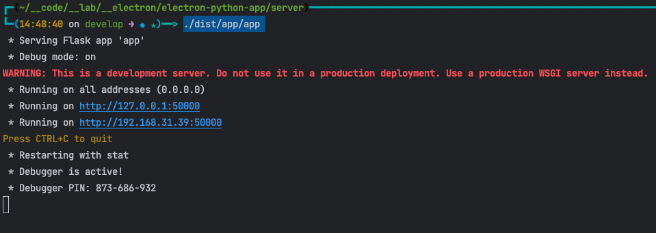

# 项目启动流程
## 先启动server
## 后启动electron
```shell
cd app
npm install
npm run start:dev
```
## 预期的输出结果


# server 端启动的办法
> 脚本均在 server 根目录下面执行
```shell
cd server
```

## 保证 python3 的安装下

### 1.初始化
```shell
sh __shell/init.sh
```
### 2.安装依赖
```shell
sh __shell/install.sh
```
### 3.启动
```shell
sh __shell/start.sh
```

### 4.构建
```shell
sh __shell/build.sh
```

### 5.启动构建后的应用
> 第一次启动可能时间会比较久
> 里面有动态链接库的检查等等
```shell
./dist/app/app 
```

